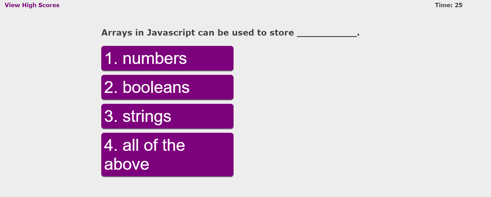

# Coding Quiz
The module 4 challenge Coding Assessment made for MSU's Full Stack Web Development Coding Bootcamp 

## Objectives
* Create a coding quiz
* Make it accessible (alt text, readable, etc)
* Have Responsive Design and supportive of smaller screen sizes
* High scores are kept, can be cleared, and displayed.

## Completed Page

https://griffinnb.github.io/coding-quiz/ 

Screenshot: 

Was created using previous activities and challenges in the bootcamp, along with tutorials and walkthroughs on google. Thank you to FreeCodeCamp for the helpful guides.